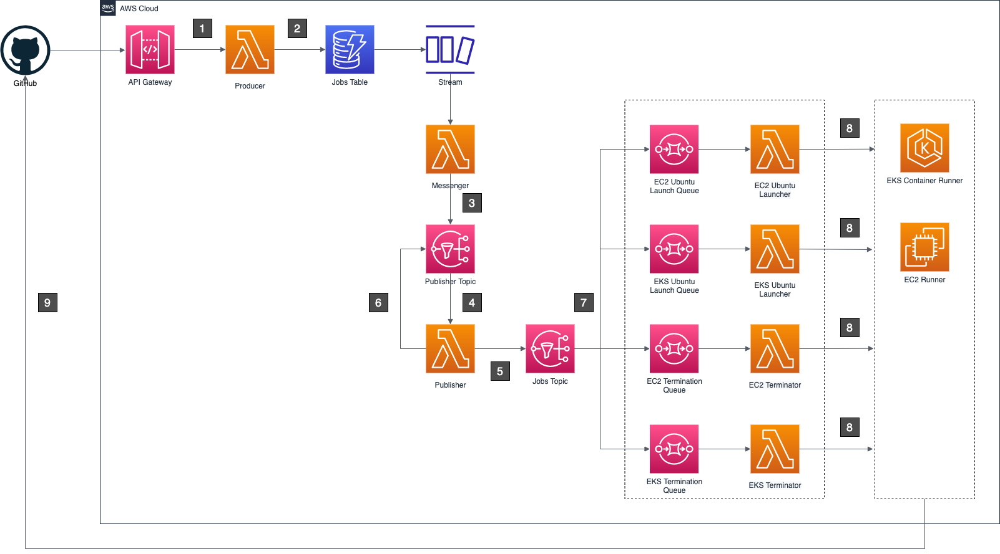

# AWS GitHub Actions Runner

This project demonstrates an approach to orchestrate ephemeral GitHub Actions Runner with different hosting for
different workflow job. For example, using `container hosting runner` for high volume code scanning or linting workflow,
and using `virtual machine hosting runner` for workflow which difficult to run on container, like iOS Apps build.

## Architecture

### Components

* `Producter` An NodeJS Lambda function which stores `workflow_job` events in `Jobs Table`.
* `Job Table` An DynamoDB Table which tracks `workflow_job` status.
* `Publisher` An Golang Lambda function which queries `Jobs Table` and sends runner orchestration message to
  SQS. `Publisher` responsible for the `flow control`, we don't want overheating AWS resource.
* `Orchestrator` Two Golang Lambda functions (Launcher and Terminator) which receives message from SQS and launch or
  terminate runners.

### Diagram

1. GitHub sends `workflow_job` events to `Producer`.
2. `Producer` inserts job events into `Jobs Table` with status ('queued' or 'completed').
3. `CloudWatch Events` triggers `Problisher` at a regular rate (e.g 10 seconds).
4. `Publisher` queries `Jobs Table` to get a limited number of jobs (configurable, and FIFO).
5. `Publisher` sends jobs (message) to `Launch SQS` or `Termination SQS` base on status ('queued' or 'completed').
6. `Orchestrator` receives message from `Launch SQS` or `Termination SQS`.
7. `Orchestrator` works out the desired runner hosting base on the `workflow_job labels`, and launch new runner or
   terminate existing runner if `workflow_job` is completed or canceled.
8. Self-hosted runner will register in GitHub, and start polling queued `workflow_job`.

## Deploy

### Prerequisites

* An AWS IAM user account which has enough permission to deploy:
    * VPC (Subnets, Route Tables, NAT Gateway...etc.)
    * API Gateway
    * DynamoDB
    * Lambda
    * EC2
    * EKS
    * ECR
    * CloudWatch Events
* Set up a GitHub Apps in your GitHub Account which has enough permission to send `workflow_job` events, and save
  the `app id`, `private key`, `app secret` and `github token` in `.env` file.

### Deploy with Docker

* Run `docker compose run --rm deployer make ci-deploy` to deploy the solution.
* Update the GitHub App URL with the API Gateway endpoint.

## Test

* Run `docker compose run --rm deployer make test` to test:
    * Producer
    * Publisher
    * Orchestrator

## TODO

* Explore replacing `CloudWatch Events` rate based trigger with `DynamoDB Streaming` and `SNS` approach.
* Support Lambda hosting runner.

